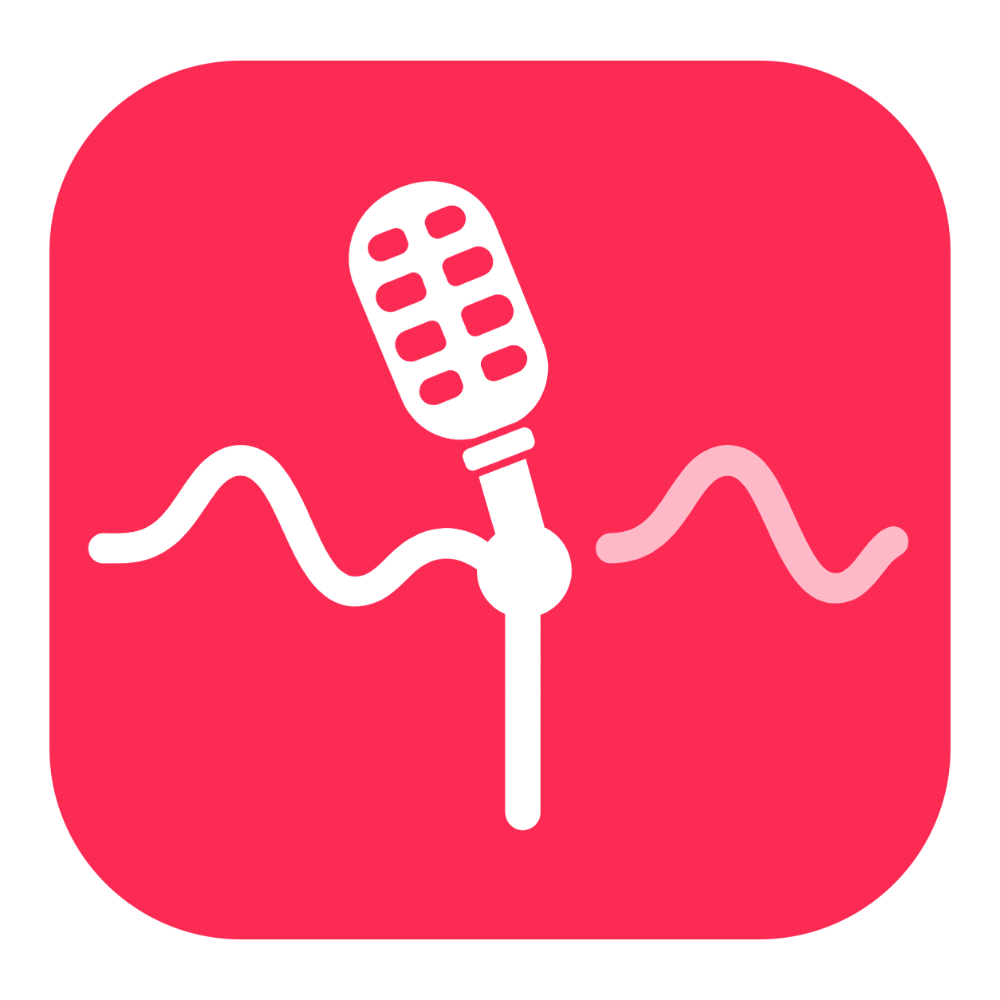
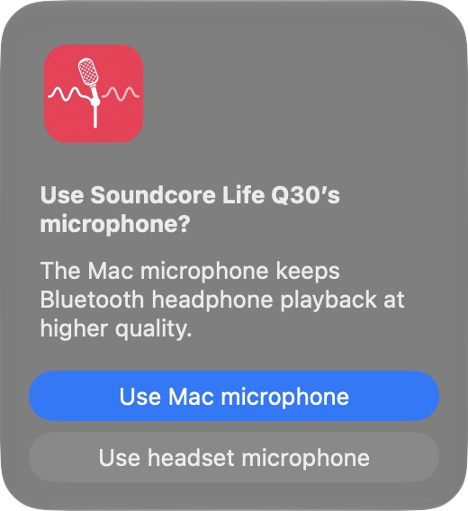

# Microphone Choice



**Keep your Bluetooth headphones sounding their best, while choosing the microphone you actually want.**

Microphone Choice is a small, open-source macOS app. When a Bluetooth device with a microphone connects, it selects your Mac's built-in microphone and asks whether you want to keep it or use the Bluetooth microphone. Your answer changes the system input device; the app leaves your output device alone.



## Why I made it

I was tired of connecting my Bluetooth headphones to my Mac and hearing the sound quality drop while listening to music or other content. The headphones sounded fine until their microphone became the input. Many Bluetooth headphones switch from a higher-quality listening mode to a mode designed for two-way audio when their microphone is used. Apple [describes this behavior](https://support.apple.com/en-us/102217) too.

Switching the input back to my Mac's microphone restored the listening experience I wanted, but doing it manually in Sound settings every time was frustrating. I made Microphone Choice for myself so that choice appears when a headset connects. I'm sharing the source and inviting contributions from anyone with the same problem.

## Install

### Homebrew (recommended)

Requires macOS 13 or newer, a Mac with a built-in microphone, and [Homebrew](https://brew.sh/). Homebrew builds the app from this repository's source using Apple's Command Line Tools.

```sh
brew install Mahad871/tap/microphone-choice
brew services start microphone-choice
```

The service starts when you log in. To stop or remove it:

```sh
brew services stop microphone-choice
brew uninstall microphone-choice
```

### Download the app

Download the universal `.zip` from [GitHub Releases](https://github.com/Mahad871/microphone-choice/releases), unzip it, move **Microphone Choice.app** to Applications, and open it once. The app registers itself as a login item. You can manage it in **System Settings → General → Login Items & Extensions**.

The release archive is ad hoc signed and **not Apple notarized**. macOS may block its first launch. If you trust this project and choose to open it, follow [Apple's Open Anyway instructions](https://support.apple.com/en-us/102445). The Homebrew source build avoids this downloaded-app check.

Use one installation method at a time so that two copies do not both ask you about the same device.

## What it does

1. Watches Core Audio for newly connected Bluetooth input devices, with a short periodic check as a fallback.
2. Selects the built-in Mac microphone while it waits for your answer.
3. Shows a centered dialog with **Use Mac microphone** highlighted and **Use Bluetooth microphone** as the other choice.
4. Keeps the Mac microphone if you dismiss the dialog or do not answer within 60 seconds.

It works with Bluetooth devices that macOS exposes as microphone inputs. It changes the **system default input**, so an app that has its own microphone setting may still need a separate change. It does not change the Bluetooth output, codec, volume, or equalizer. On startup, if a connected Bluetooth microphone is currently the system input, it restores the built-in microphone.

The app does not record audio, request microphone capture permission, collect analytics, or send data over the network. It only reads audio device information and changes the default input. Diagnostic messages go to the process's local standard error log.

## Build from source

On macOS with Apple's Command Line Tools:

```sh
git clone https://github.com/Mahad871/microphone-choice.git
cd microphone-choice
./scripts/package-release.sh
```

The universal app and ZIP appear in `build/`. The build script compiles both Apple silicon and Intel binaries, generates all macOS icon sizes from the approved artwork, and ad hoc signs the app. Run `build/Microphone Choice.app/Contents/MacOS/MicChoice --probe` to list connected Bluetooth microphones without starting the monitor. `--test-prompt` shows a diagnostic dialog for the first connected Bluetooth microphone and closes it after eight seconds.

## Contributing

Bug reports, documentation improvements, and code contributions are welcome. Please read [CONTRIBUTING.md](CONTRIBUTING.md) before opening a pull request. For a bug, include your macOS version, device model, and what happened when the Bluetooth microphone connected. Please do not post private device identifiers or logs containing sensitive information.

## License

Microphone Choice, including its icon, is available under the [MIT License](LICENSE).
