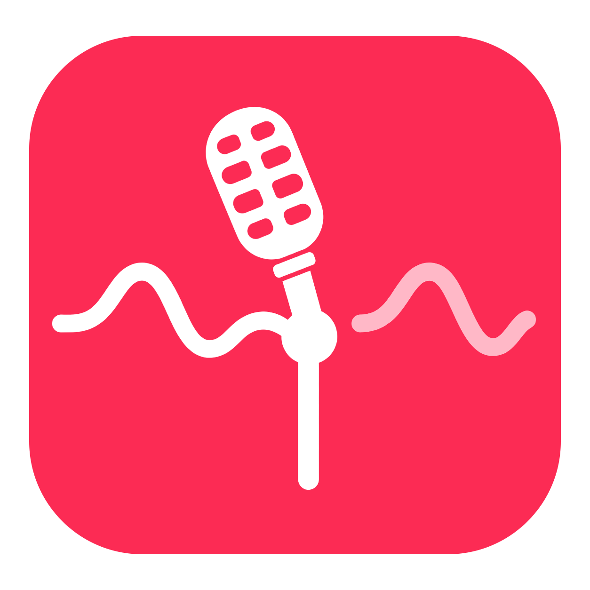
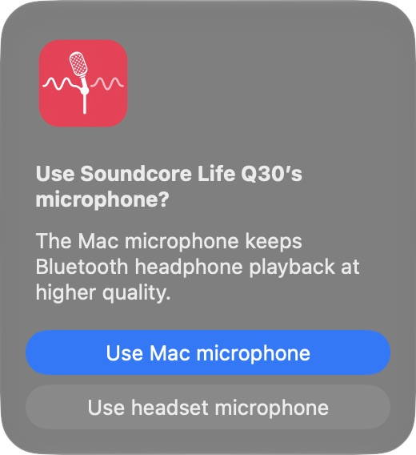

# Microphone Choice



**Keep your Bluetooth headphones sounding their best, while choosing the microphone you actually want.**

Microphone Choice is a small, open-source macOS menu bar app. When a Bluetooth device with a microphone connects for the first time, it selects your preferred microphone and asks whether you want to keep it or use the Bluetooth microphone. The default is your Mac's built-in microphone; you can choose a USB microphone or audio interface instead. On later connections, it applies any choice you saved for that device. The app leaves your output device alone.

Check **Remember my choice for this device** in the dialog to use that choice automatically on future connections. The app then shows a notification confirming the saved choice. Click **Change choice** (or the notification itself) to reopen the dialog; uncheck the box and choose a microphone to forget the saved choice. You can also change or forget choices from **Saved devices**, even when notifications are disabled.



## Why I made it

I was tired of connecting my Bluetooth headphones to my Mac and hearing the sound quality drop while listening to music or other content. The headphones sounded fine until their microphone became the input. Many Bluetooth headphones switch from a higher-quality listening mode to a mode designed for two-way audio when their microphone is used. Apple [describes this behavior](https://support.apple.com/en-us/102217) too.

Switching the input back to my Mac's microphone restored the listening experience I wanted, but doing it manually in Sound settings every time was frustrating. I made Microphone Choice for myself so that choice appears when a headset connects. I'm sharing the source and inviting contributions from anyone with the same problem.

## Install

### Homebrew (recommended)

Requires macOS 13 or newer and [Homebrew](https://brew.sh/). A built-in, USB, or other non-Bluetooth microphone is needed to avoid using a Bluetooth microphone. Homebrew builds the app from this repository's source using Apple's Command Line Tools.

```sh
brew install Mahad871/tap/microphone-choice
brew services start microphone-choice
```

The service starts when you log in and restarts if the app crashes. You can change **Start at login** in the app's settings. **Quit Microphone Choice** stops it for the current session; your login setting is retained. To open it again, use `brew services start microphone-choice`.

If macOS asks for Bluetooth access, allow it so the app can recognize headset reconnects reliably. Notifications for remembered choices also need notification permission. To stop or remove it:

```sh
brew services stop microphone-choice
brew uninstall microphone-choice
```

### Download the app

Download the universal `.zip` from [GitHub Releases](https://github.com/Mahad871/microphone-choice/releases), unzip it, move **Microphone Choice.app** to Applications, and open it once. The app registers itself as a login item. Manage startup in its settings or **System Settings → General → Login Items & Extensions**. Automatic restart after a crash is provided by the Homebrew service.

The release archive is ad hoc signed and **not Apple notarized**. macOS may block its first launch. If you trust this project and choose to open it, follow [Apple's Open Anyway instructions](https://support.apple.com/en-us/102445). The Homebrew source build avoids this downloaded-app check.

Use one installation method at a time. A single-instance guard prevents two app copies from monitoring simultaneously; opening an already-running app brings up its settings.

## Menu bar and settings

Click the microphone in the menu bar to see the current input, switch microphones, reopen the Bluetooth microphone dialog, or open settings.

| Setting | What it does |
| --- | --- |
| Preferred microphone | Selects the non-Bluetooth input to use for new connections and saved preferred choices. If it is unplugged, the app falls back to the Mac microphone or another available non-Bluetooth input. |
| Appearance | **System** follows your Mac's light or dark theme automatically. **Light** and **Dark** override it for this app. |
| Start at login | Controls startup for your installation method. Turning it off leaves the current session running until you quit. |
| Saved-choice notifications | Turns confirmation notifications on or off. Saved choices continue to apply when notifications are off. |
| Global keyboard shortcut | Opens the choice dialog for a connected Bluetooth microphone, or settings when none is connected. Disabled by default; enable it and choose a letter with modifiers. The default is **Control–Option–Command–M**. An unavailable combination leaves your previous shortcut active. |
| Saved devices | Changes the saved microphone, opens its dialog, or forgets a choice. **Undo forget** restores the most recently forgotten choice. Disconnected devices can be edited for their next connection. |
| Diagnostics | Shows the current input, detected Bluetooth microphones, observed connection times, and why a popup appeared or was skipped. **Test popup** checks the dialog without changing audio or saved choices. **Copy report** copies the local report without device identifiers. |

Saved preferred choices follow the global preferred-microphone setting. Existing saved Mac-microphone choices are preserved when you upgrade. Switching an input from the menu bar changes the current input without overwriting saved choices.

## What it does

1. Watches Bluetooth connections and Core Audio input devices, with a short periodic check as a fallback.
2. Selects the available preferred microphone while it waits for your answer.
3. Shows a centered dialog with **Use Mac microphone** (or **Use preferred microphone**) highlighted and **Use Bluetooth microphone** as the other choice.
4. Keeps the preferred microphone if you dismiss a first-time dialog or do not answer within 60 seconds. Dismissing an edit dialog leaves the input and saved choice unchanged.
5. Saves a choice only when you check **Remember my choice for this device** and choose a microphone. Saved choices stay on your Mac.

It works with Bluetooth devices that macOS exposes as microphone inputs. It changes the **system default input**, so an app that has its own microphone setting may still need a separate change. It does not change the Bluetooth output, codec, volume, or equalizer. On startup, if a connected Bluetooth microphone is currently the system input, it restores the preferred microphone unless you saved a choice to use that Bluetooth microphone. A device already connected at startup does not produce a new-connection popup; you can reopen the dialog from the menu bar.

On a Mac without an available non-Bluetooth input, the app can still offer the Bluetooth microphone, but cannot provide a separate microphone for higher-quality playback.

The app does not record audio, request microphone capture permission, collect analytics, or send data over the network. It reads Bluetooth connection status and audio device information, then changes the default input. Choices, settings, and theme overrides are stored in local app preferences. The global shortcut uses macOS hotkey registration and does not require Accessibility permission. The diagnostic report stays in memory for the current session; diagnostic messages also go to the process's local standard error log.

## Build from source

On macOS with Apple's Command Line Tools:

```sh
git clone https://github.com/Mahad871/microphone-choice.git
cd microphone-choice
./scripts/package-release.sh
```

The universal app and ZIP appear in `build/`. The build script compiles both Apple silicon and Intel binaries, generates all macOS icon sizes from the approved artwork, and ad hoc signs the app. Run `build/Microphone Choice.app/Contents/MacOS/MicChoice --probe` to list connected Bluetooth microphones without starting the monitor. `--probe-inputs` lists all microphone names and transports. `--test-prompt` shows a diagnostic dialog and closes it after eight seconds without changing audio or choices.

Run `./scripts/test-connection-tracker.sh` for the connection, saved-choice migration, settings, fallback selection, single-instance, diagnostics, and hotkey registration tests. Developers can open the built executable with `--preview` for a disposable settings session with sample devices and no audio or login-setting changes. Use `--preview-light` or `--preview-dark` with it to check both themes. Keyboard shortcuts in a preview still register with macOS until you disable them or quit.

## Contributing

Bug reports, documentation improvements, and code contributions are welcome. Please read [CONTRIBUTING.md](CONTRIBUTING.md) before opening a pull request. For a bug, include your macOS version, device model, and what happened when the Bluetooth microphone connected. Please do not post private device identifiers or logs containing sensitive information.

## License

Microphone Choice, including its icon, is available under the [MIT License](LICENSE).
